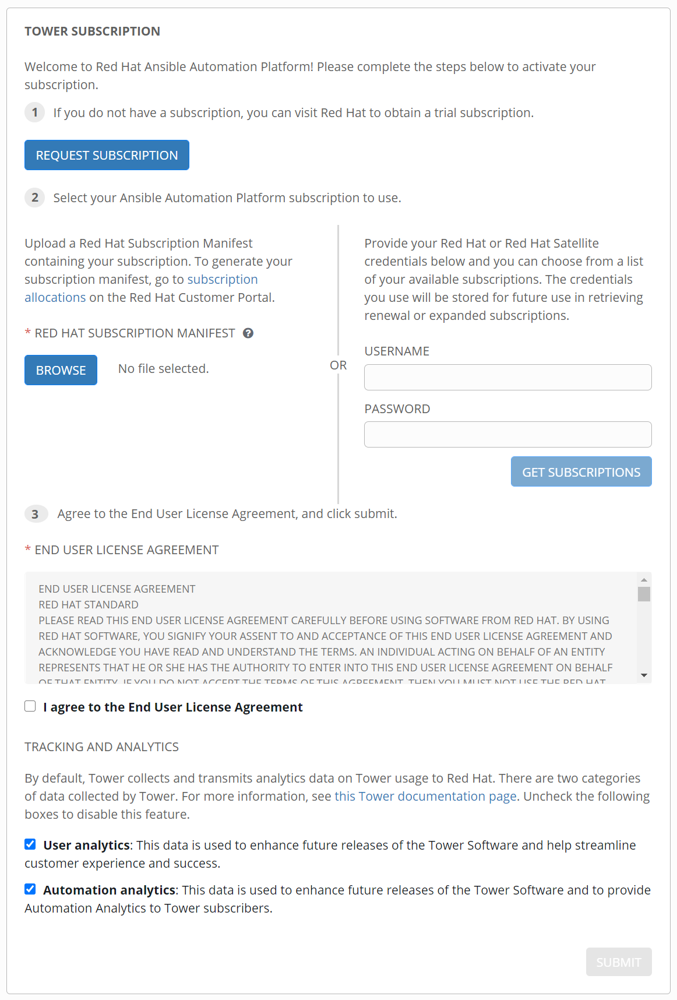
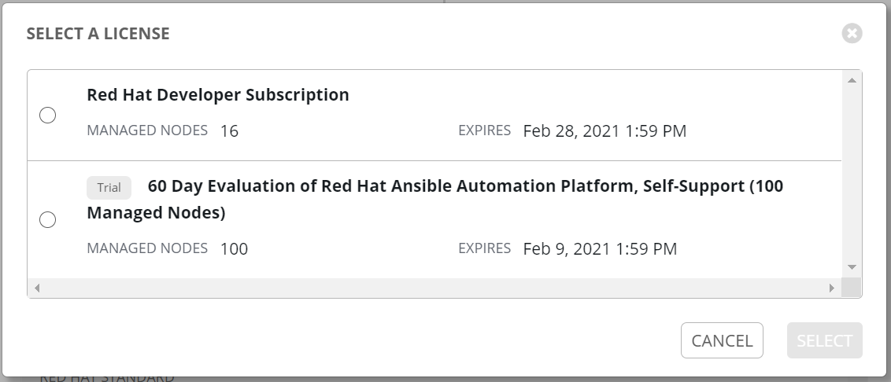

# Ansible Tower

## ライセンス

### 評価版 (Evaluation)

Ansible Tower が含まれている **Red Hat Ansible Automation Platform** には 60 日間利用できる評価ライセンスがあります。

[https://www.redhat.com/ja/technologies/management/ansible/try-it](https://www.redhat.com/ja/technologies/management/ansible/try-it){target=_blank}

### Developer Program

Red Hat Developer Program 
[https://developers.redhat.com/products/ansible/getting-started](https://developers.redhat.com/products/ansible/getting-started)

## インストール

### 前提条件

インストール先の OS は **RHEL 8.3** を使用します。
Ansible Tower の次期メジャーバージョンでは RHEL 7 や CentOS がサポート対象外となるためです。

```sh
#/etc/os-release 
NAME="Red Hat Enterprise Linux"
VERSION="8.3 (Ootpa)"
ID="rhel"
ID_LIKE="fedora"
VERSION_ID="8.3"
PLATFORM_ID="platform:el8"
PRETTY_NAME="Red Hat Enterprise Linux 8.3 (Ootpa)"
ANSI_COLOR="0;31"
CPE_NAME="cpe:/o:redhat:enterprise_linux:8.3:GA"
HOME_URL="https://www.redhat.com/"
BUG_REPORT_URL="https://bugzilla.redhat.com/"

REDHAT_BUGZILLA_PRODUCT="Red Hat Enterprise Linux 8"
REDHAT_BUGZILLA_PRODUCT_VERSION=8.3
REDHAT_SUPPORT_PRODUCT="Red Hat Enterprise Linux"
REDHAT_SUPPORT_PRODUCT_VERSION="8.3"
```

### インベントリ編集

インストール前に `inventory` ファイルを編集します。
以下の設定は必須です。

- admin_password
- pg_password

### シェルスクリプト実行

`./setup.sh` を実行します。
スクリプト内で ansible コマンド等もインストールされます。

```sh
$ sudo ./setup.sh
(snip)
PLAY RECAP ******************************************************************************************************************
localhost                  : ok=191  changed=79   unreachable=0    failed=0    skipped=86   rescued=0    ignored=2   

The setup process completed successfully.
Setup log saved to /var/log/tower/setup-2021-01-05-01:10:04.log.
```

## インストールで失敗した場合

以下のエラーでインストールが失敗した場合、en の locale が不足している可能性があります。

```sh
$ sudo ./setup.sh
(snip)
TASK [restart postgresql when authentication settings changed] *************************************************************
fatal: [localhost]: FAILED! => {"changed": false, "msg": "Unable to restart service postgresql: Job for postgresql.service failed because the control process exited with error code.\nSee \"systemctl status postgresql.service\" and \"journalctl -xe\" for details.\n"}
(snip)

$ locale -a
C
C.utf8
POSIX
ja_JP.eucjp
ja_JP.utf8
```

このような場合は、`glibc-langpack-en` をインストールします。

```sh
$ sudo yum install glibc-langpack-en
```

## サブスクリプション登録

Ansible Tower にログインするとサブスクリプション登録画面が表示されます。



USERNAME と PASSWORD を入力して「GET SUBSCRIPTIONS」を押下すると、ライセンス選択画面が表示されます。

