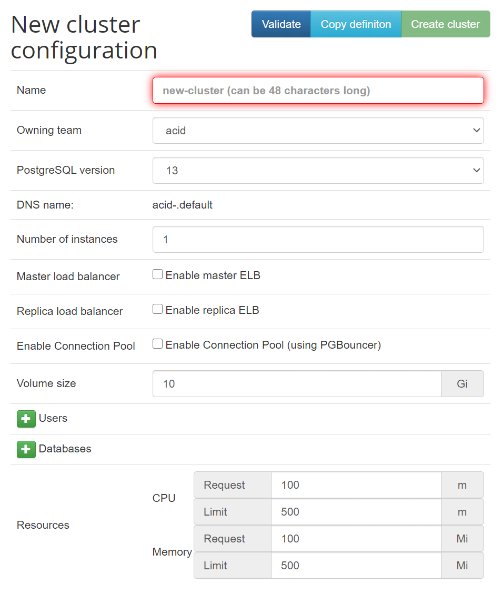

# Zalando Postgres Operator

Zalando 社が開発している Postgres Operator をデプロイする手順です。

## Operator デプロイ

[公式ドキュメント](https://github.com/zalando/postgres-operator/blob/v1.6.0/docs/quickstart.md#deployment-options)

3種類のデプロイ方法があります。

- マニュアル
- Kustomize
- Helm chart

### マニュアル

```sh
git clone https://github.com/zalando/postgres-operator.git
cd postgres-operator/

kubectl create namespace zalando-postgres
config set-context $(kubectl config current-context) --namespace=zalando-postgres

kubectl create -f manifests/configmap.yaml
kubectl create -f manifests/operator-service-account-rbac.yaml  # namespace: defualt のものがあるので注意
kubectl create -f manifests/postgres-operator.yaml
kubectl create -f manifests/api-service.yaml
```

## Web UI デプロイ

### マニュアル

```sh
kubectl apply -f ui/manifests/
```

!!! attention
    kustomize のマニフェストで以下のエラーが出てデプロイできてません。

    ```sh    
    error: unable to recognize "manifests/kustomization.yaml": no matches for kind "Kustomization" in version "kustomize.config.k8s.io/v1beta1"
    ```

!!! note
    自宅ラボでは Ingress ではなく type: Loadbalancer を使っています。

## PostgreSQL デプロイ

Postgres Operator を使って PostgreSQL をデプロイする方法は2種類あります。

- マニフェスト
- Web UI

### マニフェスト

公式リポジトリにサンプルマニフェストがあるので、参照しながら Postgres マニフェストを用意してデプロイします。

```yaml
# example
apiVersion: acid.zalan.do/v1
kind: postgresql
metadata:
  name: acid-example
  namespace: default
  labels:
    team: acid
spec:
  teamId: acid
  postgresql:
    version: "13"    # note: String
  numberOfInstances: 1
  volume:
    size: 1Gi
    storageClass: rook-ceph-block
  users:
    example: []
  databases:
    example: example
  allowedSourceRanges:
  resources:
    requests:
      cpu: 100m
      memory: 100Mi
    limits:
      cpu: 500m
      memory: 500Mi
```

### Web UI

デプロイした Service または Ingress にアクセスします。
クラスタ作成画面が表示されるので、項目入力して Create cluster。



!!! attention
    Web UI 経由でデプロイする場合に volume.storageClass を指定できません。
    そのままでは PVC が Pending のままでエラーとなります。

    そのため、Rook Ceph で作成した storageClass などを指定する場合はマニフェストを使います。
    Web UI では基本的な情報を埋め込んだマニフェストを作成し、細かい設定はマニフェストに直接記述するのが良さそうです。

## 確認

```sh
# namespace: default
export PGMASTER=$(kubectl get pods -o jsonpath={.items..metadata.name} -l application=spilo)
kubectl port-forward $PGMASTER 6432:5432

kubectl get secret postgres.acid-example.credentials -o 'jsonpath={.data.password}' | base64 -d
export PGSSLMODE=require
```

## CentOS 7 への psql インストール

```sh
sudo yum install -y https://download.postgresql.org/pub/repos/yum/reporpms/EL-7-x86_64/pgdg-redhat-repo-latest.noarch.rpm
sudo yum install -y postgresql13
```